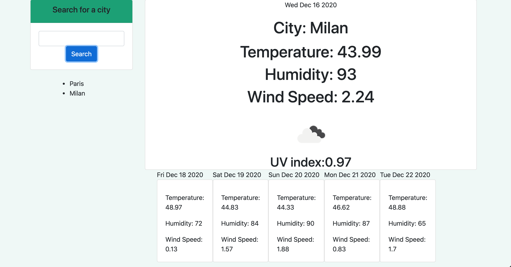

# Forecast Dashboard

# Project Description
To create a city search forecast application that searches for any location's weather forecast with real time updates.

* This project applies HTMl, CSS, Javascript, and Jquery applications. With the use of Javascript and Jquery, we are able to assess user city input request and return data values for weather information that is realistic and projected over a 5-day period.

# Demo Features:
* The following image and gif shows the web application's appearance and functionality:

# Live URL:
<a href="https://sjohn214.github.io/ForecastDashboard/">Forecast Dashboard URL Live</a>

<a href="https://github.com/sjohn214/ForecastDashboard.git">Forecast Dashboard GitHub Repo</a>

# Summary
* In this project a weather forecast dashboard was created utilizing HTML, CSS, Javascript, and Jquery. Javascript and Jquery are used heavily to create the responsive outputs from weather app.

# Special Features:
* HTML page
  * Index.html
    * Landing with card text box.
* CSS elements 
  * Bootstrap css stlying on Index.html.
* Javascript page
  * Variables
  * Arrays with objects
  * Jquery language 
  * For loops
  * Functions
  * Local storage

# Authors
* Shannondale Page (student) <a href="https://github.com/sjohn214">Git Hub Profile</a>
* Austin Bruch (Bootcamp Instructor)
* Jon Jackson (Bootcamp TA Instructor)
* Daniel Sires (Bootcamp Tutor)